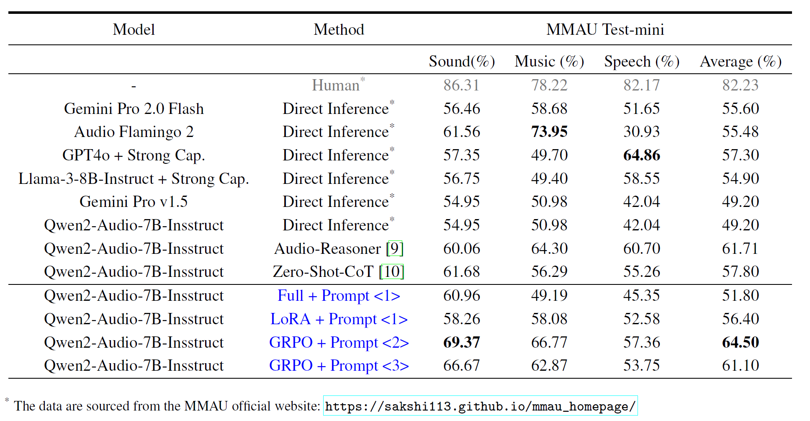

# R1-AQA: Reinforcement Learning Outperforms Supervised Fine-Tuning: A Case Study on Audio Question Answering

R1-AQA extends `Qwen2-Audio-7B-Instruc` by integrating group relative policy optimization (GRPO). This adaptation enhances the model's capacity for temporal reasoning and contextual alignment in audio question answering (AQA) tasks. Our experiments demonstrated state-of-the-art performance on the MMAU test-mini benchmark, achieving an accuracy rate of 64.5%.



**Huggingface:**  

[🤗 R1-AQA Models: mispeech/r1-aqa](https://huggingface.co/mispeech/r1-aqa)  

**arXiv:**  
[📝 Reinforcement Learning Outperforms Supervised Fine-Tuning: A Case Study on Audio Question Answering]()


**R1-AQA Team:**  
[Gang Li](https://github.com/GrantL10)`*` · [Jizhong Liu](https://github.com/frankenliu)`*` · [Heinrich Dinkel](https://github.com/RicherMans) · [Yadong Niu](https://github.com/nyd3001) · [Junbo Zhang](https://github.com/jimbozhang)  

`*` These authors contributed equally to this work.


### Updates

- 2025-03-16: We release the R1-AQA repo.


## Training

### Data Preparation
  
We use the [AVQA](https://mn.cs.tsinghua.edu.cn/avqa/) `train` subset (train_qa.josn). And convert data to the R1-AQA format -- a text file where each line represents a JSON object with the following keys:
```json
{
    # The data presented below originate from the original AVQA dataset.
    "id": 183,
    "video_name": "-HG3Omg_89c_000030",
    "video_id": 341,
    "question_text": "What happened in the video?",
    "multi_choice": [  
        "motorboat",  
        "Yacht consignment",  
        "Sailboat set sail",  
        "Consignment car"  
    ],
    "answer": 1,
    "question_relation": "View",
    "question_type": "Happening", 
    # We add the following data.
    "dataset_name": "AVQA",
    "audio_path": "Path to wav dir/-HG3Omg_89c_30.wav"
}
```
### GRPO
```bash
sh run_grpo.sh
```

#### Wandb


#### NOTE:
- Replace the `DATA_FILE` variable in the `run_grpo.sh` with your dataset path.
- If you have downloaded the `Qwen2-Audio-7B-Instruct` model, modify the `MODEL_NP` variable in `run_grpo.sh` to your local model path.


## Testing

### MMAU-mini
To evaluate the MMAU-mini dataset, follow these steps:
- Download Data  
Testing the MMAU-mini dataset requires the following files from the [MMAU](https://github.com/Sakshi113/MMAU/tree/main) repository: [mmau-test-mini.json](https://github.com/Sakshi113/MMAU/blob/main/mmau-test-mini.json), [evaluation.py](https://github.com/Sakshi113/MMAU/blob/main/evaluation.py) and [test-mini-audios.tar.gz](https://drive.google.com/file/d/1fERNIyTa0HWry6iIG1X-1ACPlUlhlRWA/view?usp=sharing). A proper method to obtain the data is outlined below:
```bash
mkdir -p data && cd data

git clone https://github.com/Sakshi113/MMAU.git

cd data/MMAU

#TODO you should download test-mini-audios.tar.gz to here
***download test-mini-audios.tar.gz to here***

# Uncompress wav files
tar -xzvf test-mini-audios.tar.gz

cd ../../
```
- Format Data  
```bash
# Prepare the data format file we need
python src/utils/prepare_mmau.py \
    --input_file data/MMAU/mmau-test-mini.json \
    --wav_dir data/MMAU/test-mini-audios \
    --out_file data/MMAU/mmau-mini.data
```
- Evaluation
```bash
# Testing MMAU-mini with in steps: [100, 200, 300, 400, 500]. You can modify the script to test other steps or change other parameters.
sh test_mmau.sh
```


## Citation

```bib
@misc{li2025r1aqa,
  author       = {Li, Gang and Liu, Jizhong and Dinkel, Heinrich and Niu, Yadong and Zhang, Junbo and Luan, Jian},
  title        = {R1-AQA: Reinforcement Learning Outperforms Supervised Fine-Tuning: A Case Study on Audio Question Answering},
  howpublished = {\url{https://github.com/xiaomi/r1-aqa}},
  note         = {Accessed: 2025-03-16},
  year         = {2025}
}
```
