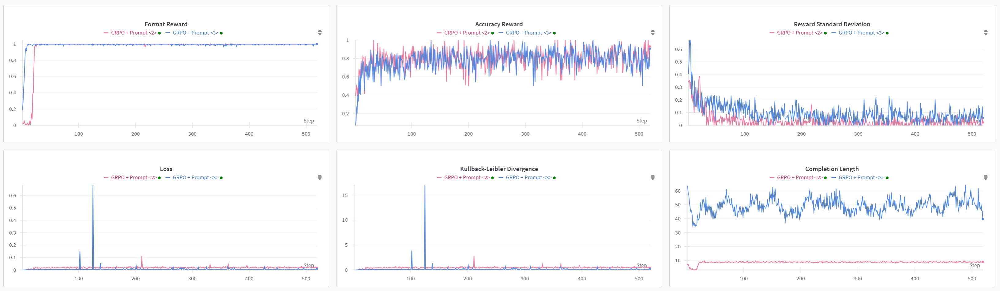

# R1-AQA --- Reinforcement Learning Outperforms Supervised Fine-Tuning: A Case Study on Audio Question Answering

## Introduction

R1-AQA is a audio question answering (AQA) model based on `Qwen2-Audio-7B-Instruct`, optimized through reinforcement learning (RL) using the group relative policy optimization (GRPO) algorithm.
This implementation has achieved state-of-the-art performance on MMAU *Test-mini* benchmark with only 38k post-training samples.

Our main findings are as follows:

- The GRPO algorithm can be directly and effectively applied to the audio modality, even to `Qwen2-Audio-7B-Instruct` with only 8.2B parameters.
- With only 38k post-training samples, reinforcement learning outperforms supervised fine-tuning, indicating that RL-based approaches can be effective without large datasets.
- The explicit reasoning process has not shown significant benefits for AQA tasks, and how to efficiently leverage *deep thinking* or step-by-step remains an open question for further research.
- Large audio language models (LALMs) still lag far behind humans auditory-language reasoning, suggesting that the RL-based approaches warrant further explorations.

### Table: Accuracies (%) on MMAU Test-mini benchmark

| Model                                      | Method                  | Sound  | Music  | Speech | Average |
|--------------------------------------------|-------------------------|--------|--------|--------|---------|
| \                                          | Human\*                 | 86.31  | 78.22  | 82.17  | 82.23   |
| Gemini Pro 2.0 Flash                       | Direct Inference\*      | 56.46  | 58.68  | 51.65  | 55.60   |
| Audio Flamingo 2                           | Direct Inference\*      | 61.56  | **73.95** | 30.93  | 55.48   |
| GPT4o + Strong Cap.                        | Direct Inference\*      | 57.35  | 49.70  | **64.86** | 57.30   |
| Llama-3-8B-Instruct + Strong Cap.          | Direct Inference\*      | 50.75  | 48.93  | 55.25  | 52.10   |
| Gemini Pro v1.5                            | Direct Inference\*      | 56.75  | 49.40  | 58.55  | 54.90   |
| Qwen2-Audio-7B-Instruct                    | Direct Inference\*      | 54.95  | 50.98  | 42.04  | 49.20   |
| GPT4o + Weak Cap.                          | Direct Inference\*      | 39.33  | 41.90  | 58.25  | 45.70   |
| Llama-3-8B-Instruct + Weak Cap.            | Direct Inference\*      | 34.23  | 38.02  | 54.05  | 42.10   |
| SALMONN                                    | Direct Inference\*      | 41.00  | 34.80  | 25.50  | 33.70   |
| Qwen2-Audio-7B-Instruct                    | CoTA \[1\]              | 60.06  | 64.30  | 60.70  | 61.71   |
| Qwen2-Audio-7B-Instruct                    | Zero-Shot-CoT \[2\]     | 61.86  | 56.29  | 55.26  | 57.80   |
| **Qwen2-Audio-7B-Instruct**                | **GRPO (Ours)**         | **69.37** | 66.77  | 57.36  | **64.50** |

#### Notes

\* The data are sourced from the MMAU official website: [https://sakshi113.github.io/mmau_homepage/](https://sakshi113.github.io/mmau_homepage/)  
\[1\] Xie, Zhifei, et al. "Audio-Reasoner: Improving Reasoning Capability in Large Audio Language Models." arXiv preprint arXiv:2503.02318 (2025).  
\[2\] Ma, Ziyang, et al. "Audio-CoT: Exploring Chain-of-Thought Reasoning in Large Audio Language Model." arXiv preprint arXiv:2501.07246 (2025).  

**Huggingface:**  
[🤗 R1-AQA Models: mispeech/r1-aqa](https://huggingface.co/mispeech/r1-aqa)  

**arXiv:**  
[📝 Reinforcement Learning Outperforms Supervised Fine-Tuning: A Case Study on Audio Question Answering](https://arxiv.org/abs/2503.11197)

**R1-AQA Team:**  
[Gang Li](https://github.com/GrantL10)`*` · [Jizhong Liu](https://github.com/frankenliu)`*` · [Heinrich Dinkel](https://github.com/RicherMans) · [Yadong Niu](https://github.com/nyd3001) · [Junbo Zhang](https://github.com/jimbozhang) · [Jian Luan](https://github.com/jianluan)

`*` Euqual contribution.

### Updates

- 2025-03-18: Support the mode containing `<think> </think>` (*GRPO + Prompt <3>* in our technical report).
- 2025-03-17: Release the R1-AQA repo.

## Training

### Data Preparation

We use the [AVQA](https://mn.cs.tsinghua.edu.cn/avqa/) `training` subset (train_qa.josn), and convert the data to the R1-AQA format, where each line in the text file represents a JSON object with specific keys

```json
{
    # The data presented below originate from the original AVQA dataset.
    "id": 183,
    "video_name": "-HG3Omg_89c_000030",
    "video_id": 341,
    "question_text": "What happened in the video?",
    "multi_choice": [  
        "motorboat",  
        "Yacht consignment",  
        "Sailboat set sail",  
        "Consignment car"  
    ],
    "answer": 1,
    "question_relation": "View",
    "question_type": "Happening", 
    # We add the following data.
    "dataset_name": "AVQA",
    "audio_path": "Path to wav dir/-HG3Omg_89c_30.wav"
}
```

### GRPO

```bash
sh run_grpo.sh
```

#### Wandb



#### NOTE

- Replace the `DATA_FILE` variable in the `run_grpo.sh` with your dataset path.
- If you already have the `Qwen2-Audio-7B-Instruct` model, please modify the `MODEL_NP` variable in `run_grpo.sh` to your local model path.

## Testing

### MMAU Test-mini

Evaluate the MMAU `Test-mini` dataset, please follow these steps:

- Download Data
  - To test the MMAU Test-mini dataset requires the following files from the [MMAU](https://github.com/Sakshi113/MMAU/tree/main) repository: [mmau-test-mini.json](https://github.com/Sakshi113/MMAU/blob/main/mmau-test-mini.json), [evaluation.py](https://github.com/Sakshi113/MMAU/blob/main/evaluation.py), and [test-mini-audios.tar.gz](https://drive.google.com/file/d/1fERNIyTa0HWry6iIG1X-1ACPlUlhlRWA/view?usp=sharing). The method for obtaining data is as follows:

```bash
mkdir -p data && cd data

git clone https://github.com/Sakshi113/MMAU.git

cd data/MMAU

#TODO you should download test-mini-audios.tar.gz to here
***download test-mini-audios.tar.gz to here***

# Uncompress wav files
tar -xzvf test-mini-audios.tar.gz

cd ../../
```

- Format Data  

```bash
# Prepare the data format file we need
python src/utils/prepare_mmau.py \
    --input_file data/MMAU/mmau-test-mini.json \
    --wav_dir data/MMAU/test-mini-audios \
    --out_file data/MMAU/mmau-mini.data
```

- Evaluation

```bash
# Testing MMAU test-mini with in steps: [100, 200, 300, 400, 500]. 
# You can modify the script to test other steps or change other parameters.
sh test_mmau.sh
```

## Hacking It

We encourage hacking it on your own. If you want to see the "thinking" or improve our work, here are some hints:

> 1. Uncomment the line 25 of `src\dataset\dataset.py`;
> 2. Uncomment the line 55 of `src\utils\rewards.py`;
> 3. Uncomment the line 46 of `src\test.py`;
> 4. Train and test your model;
> 5. ***Design your CoT strategy based on `<think> </think>`. Let's explore effective ways to combine RL and CoT!***

## Acknowledgement

> 1. We have referred to the implementation of [R1-V](https://github.com/Deep-Agent/R1-V) for the GRPO-based training.
> 2. We sincerely thank [AVQA](https://mn.cs.tsinghua.edu.cn/avqa/) and [MMAU](https://github.com/Sakshi113/MMAU/tree/main) for providing the datasets.

## Citation

```bib
@misc{li2025reinforcementlearningoutperformssupervised,
      title={Reinforcement Learning Outperforms Supervised Fine-Tuning: A Case Study on Audio Question Answering}, 
      author={Gang Li and Jizhong Liu and Heinrich Dinkel and Yadong Niu and Junbo Zhang and Jian Luan},
      year={2025},
      eprint={2503.11197},
      archivePrefix={arXiv},
      primaryClass={cs.SD},
      url={https://arxiv.org/abs/2503.1119; https://github.com/xiaomi-research/r1-aqa}, 
}
```
